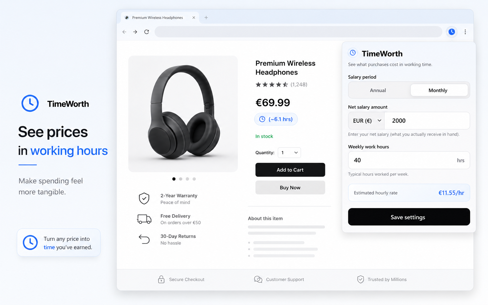
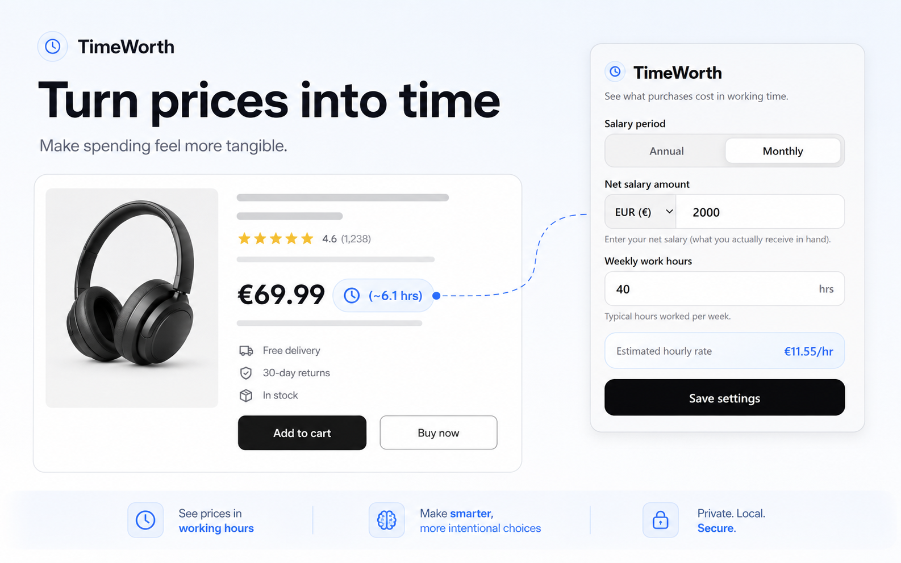
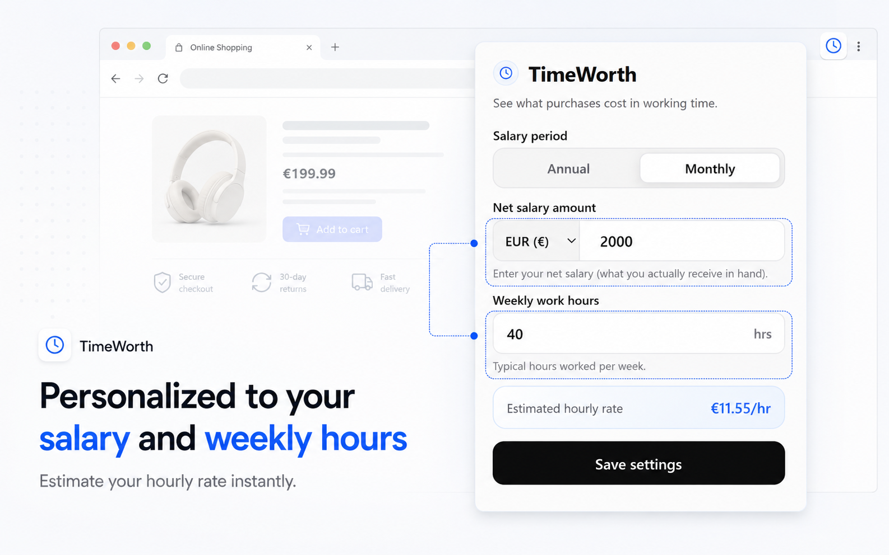

# TimeWorth

TimeWorth is a Chrome extension that helps you see Amazon prices in a more personal way: your working time.

Instead of thinking only in money, TimeWorth converts product prices into estimated work hours based on your salary, currency, and weekly schedule.

## Why TimeWorth?

Online shopping makes prices easy to compare, but it does not always make cost easy to feel. TimeWorth adds a small working-hours badge near Amazon prices so you can quickly understand what a purchase represents in your own time.

## Features

- Convert Amazon prices into estimated working hours.
- Configure salary period, salary amount, currency, and weekly work hours.
- See lightweight badges next to supported Amazon product prices.
- Automatically updates badges when settings change.
- Supports English and Spanish based on browser language.
- Stores settings with Chrome sync.
- No account, backend, analytics, or tracking.

## Screenshots

### See prices in working hours

### Configure your time value

## How it works

1. Open the TimeWorth popup.
2. Choose your currency.
3. Enter your salary type, salary amount, and weekly work hours.
4. Browse supported Amazon sites.
5. TimeWorth displays an estimated work-hours badge next to product prices.

## Privacy

TimeWorth stores only the settings needed for its calculations:

- currency symbol
- salary type
- salary amount
- weekly work hours

Those settings are stored with `chrome.storage.sync`. TimeWorth does not send your settings, Amazon prices, or browsing activity to an external server.

See the full policy in [`docs/publication/privacy-policy.md`](docs/publication/privacy-policy.md).

## Supported sites

TimeWorth runs on supported Amazon domains declared in [`manifest.json`](manifest.json), including Amazon US, UK, Spain, Mexico, Canada, Germany, France, Italy, Japan, Brazil, Australia, India, and others.

## Local installation

To try the extension locally:

1. Clone this repository.
2. Open Chrome and go to `chrome://extensions`.
3. Enable **Developer mode**.
4. Click **Load unpacked**.
5. Select the project folder.

## Publication status

TimeWorth is being prepared for Chrome Web Store publication. Publication copy, checklist, and privacy notes live in [`docs/publication`](docs/publication).
